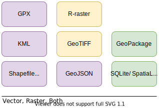
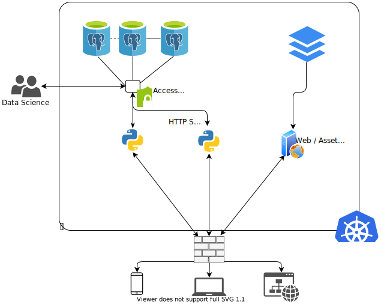

---
output:
    xaringan::moon_reader:
        lib_dir: libs
        css: ["default", "css/sfah.css", "css/fonts.css"]
        nature:
            highlightStyle: github
            highlightLines: true
            countIncrementalSlides: false
            ratio: "4:3"
            beforeInit: "https://platform.twitter.com/widgets.js"
        seal: false
        includes:
            in_header: header.html
editor_options: 
  chunk_output_type: inline
---

```{r setup, include=FALSE, cache=FALSE}
knitr::opts_chunk$set(
  comment = '',
  fig.width = 6,
  fig.height = 6,
  fig.retina = 3,
  echo = TRUE,
  warning=FALSE,
  message=FALSE,
  cache=FALSE
)

# Packages
library(dplyr)
library(kableExtra)
library(gt)
library(fontawesome)
library(DT)
library(DiagrammeR)
library(datamodelr)
library(leafpop)
library(mapview)

# Bibliography

library(RefManageR)
BibOptions(
  check.entries = FALSE,
  bib.style = "authoryear",
  #cite.style = "authoryear",
  style = "markdown",
  hyperlink = TRUE,
  dashed = FALSE
)

myBib <- ReadBib("postgis_references.bib", check = FALSE)


# Database connection
library(DBI)
db <- DBI::dbConnect(
  RPostgres::Postgres(),
  host = "localhost",
  port = "5432",
  user = "malte",
  dbname = "gis",
  password = "password" 
  # Oh god! there are credentials on GH!!!
  # It is local only anyways ;) 
) 


```

layout: true

<div class="my-footer">
    <span>
        <a href="https://www.github.com/MKyhos", style="color:white;">
            `r fa(name="github", fill="white")` https://www.github.com/MKyhos
        </a>
    </span>
</div>

---

class: middle
background-image: url("http://www.johngordonart.com/wp-content/uploads/2015/02/Elephant-World-Drawing-v2-by-Artist-John-Gordon-1024x1024.jpg")
background-position: bottom right
background-size: 400px 400px
# An Introduction to PostGIS
.fancy2[...PostgreSQL going spatial]


<p style="margin-top:4cm;"> 
    CorrelCon 2020 <br>
    <a href="https://twitter.com/maltekyhos">
        `r fa(name = "twitter")` @maltekyhos
    </a>
</p>


???

Welcome
Credits to Crunchy Data

---
class: middle, inverse

# Tools and Formats for Spatial Data

* Getting an overview of tools and software
* Do the file formats fit the requirements?

---

The landscape (`r emo::ji("drum")`) of spatial tools

```{r echo=FALSE, results='asis', out.height = 450, out.width = 600, fig.align = "center"}
knitr::include_graphics(path="fig_spatial_software_hierarchy.svg")
```


???

* Incomplete survey of tools for geo spatial data
* we have heard a lot 

---


#### File format and infrastructure

.pull-left[
Formats occuring in the wild:

```{r echo=FALSE, out.width=250, out.height = 300, fig.align="center" }

```


]

.pull-right[
Possible drawbacks: what about

* Versioning
* Concurrent Access?
* Reliability?
* Scalability?
* Compatibility?
* Also in short, ACID?
]

???

ACID principles in information systems:

* atomicity of transactions
* consistency
* isolation of users
* durability

---
class: middle

Are we searching for a system that has the following
assets?

- Integration with various tools
    - Desktop applications
    - Server middleware
    - Web Applications
    - Programming languages
- Functions and types
- Speed! Scalability, security, reliability
- Open Source


Then we might turn to PostGIS! `r emo::ji("tada")`


???

So the question is again, what do we desire? Which kind of system is
needed?


---

It even can easily be integrated in some generic infrastructure 
`r Citep(myBib, "pousty2019alltogeter")`:

```{r echo=FALSE, result='asis', out.height = 450, out.width = 600, fig.align = "center"}

```

???

Lets suppose we have the following infrastructue:

* Some Cluster with
  * Database instances
  * Rest Endpoints
  * Flat files, and server,
  * A firewall,
  * talking to data science team, and mobile app, 

We can simply add spatial capabilities by enabling postgis in the 


---
class: middle


.fancy2[Take away:] PostGIS...

- integrates well into existing, standard infrastructure
- no need for specialized servers (e.g. GeoServer)
- less training required (standard tools)
- only additional team requirement: spatial specialists
- open source!

But also

- might not be feasible for small one-off research projects
- requires some knowledge in DB administration, and the command line
- requires a server
- technical overhead might be real!


???

So, some take aways so far:

fit for purpose!


---
class: middle, inverse


# Turning to PostGIS


---

**Differences, coming from PostgreSQL**

|           | Standard PostgreSQL       | PostGIS                         |
|-----------|---------------------------|---------------------------------|
| Types     | int, real, json, date     | geometry, geography             |
| Indexes   | B-Tree...                 | R-Tree, ...                     |
| Functions | Avg(), Min(), json_each() | ST_Transform(), ST_Length(),... |


**Differences, coming from R**

* Setup and administration of some PG instance
* Write SQL instead of R (but: functions have same )
* Unfortunately, `{dbplyr}` does not support PostGIS functions (yet). But `{sf}`
  works nice with PostGIS.

We had a nice introduction to the **data model** already by Michael `r emo::ji("pray")`

* Point, Line, Polygon
* MultiPoint, MultiLineString, MultiPolygon
* GeometryCollection
* MultiCurve
* 3D Geometries: PolyHedralSurface

Furthermore, raster grids and $S^2$ geography types are supported!

---


## Tools


<dl>
  <dt><b>Interfaces</b></dt>
    <dd><code>psql</code>: Commandline interface, 
      check out <code>pgcli</code> as well!</dd> 
    <dd><code>pgAdmin4</code>: GUI (open source) </dd>
    <dd><code>DataGrip</code>: GUI (commercial) </dd>
    <dd><code>DBeaver</code>: GUI (community version available) </dd>
</dl>

<dl>
  <dt><b>Data Import</b></dt>
    <dd><code>osm2pgsql</code>: import OpenStreetMap data</dd>
    <dd><code>shp2pgsql</code>: import Shapefiles</dd>
    <dd><code>ogr2ogr</code>: convert/import/export various types (
      <code>geojson</code>,
      GeoPackage, ...)</dd>
</dl>


???

For all tools, better documentation and tutorials
are provided elsewhere.

Just some examples for common tasks, so it is not sorcery 
at all.

---

**Example:** Create extension:

```{sql eval=FALSE}
CREATE EXTENSION postgis;
```

**Example:** Create table with spatial column:

```{sql eval=FALSE}
CREATE TABLE census_grid (
  grid_id_num int PRIMARY KEY,
  geom Geometry(Polygon, 25832)
);
```

**Example:** Import shapefile into running database:

```{shell eval=FALSE}
shp2pgsql \
  -s 25833 \
  Berlin_Ubahnhoefe_25833.shp
  public.berlin_metro_station | 
  psql service=test-gis
```

---
class: middle, inverse 

# Demonstrative Examples

Data, Berlin Scope:

* Census 2011 Grid
* OpenStreetMap Berlin
* Berlin Subway stations & lines

---

Retrieve information about geometry columns in a database:

```{sql connection = db}
SELECT f_table_name, f_geometry_column, srid, type 
FROM geometry_columns;
```


---

### Geographical Projections (`PROJ`)

* We had a great introduction by Michael 
* Remember: use of appropriate projected reference system for distance 
  calculation etc!
* For web maps, usualy turn to ETRS 4326 (Web Mercator).


* Transformation of coordinates: `ST_Transform(geom, SRID)`
* Also, permanent update of spatial reference ID:

```{sql eval=FALSE}
ALTER TABLE planet_osm_polygon 
  ALTER COLUMN way 
    TYPE geometry(Geometry, 5243) 
    USING ST_Transform(way, 5243);
```

---

### Testing Relationships, Generate Geometries, etc.


1. Relationship (predicates)
  - `ST_Intersects()`, `ST_Contains()`,
    `ST_Touches()`, `ST_Overlaps()`, `ST_Within()`...
2. Geometry generation
  - `ST_Buffer()`, `ST_Union()`, `ST_Intersection()`, 
    `ST_SymDifference()`, `ST_Difference()`

3. Many more!

Often desired: a spatial join.

$$\text{SpatialJoin}(X, Y, \pi) = \{(o_x, o_y)~|~o_x \in X, o_y \in Y, \pi(o_x, o_y)\}$$


---

### Example: Spatial Join

Grab Food nearby the station

```{sql connection=db}
SELECT m.nam as station_name, Count(*) as nearby_restaurants
FROM berlin_metro_station AS m,
	(SELECT name AS restaurant_name, way AS geom
	FROM planet_osm_point
	WHERE amenity = 'restaurant') AS r
WHERE ST_Covers(ST_Buffer(m.geom, 250), r.geom)
GROUP BY 1 ORDER BY 2 DESC LIMIT 5;
```

??? 

As said, with a spatial join one can integrate data based
on geographic proximity, that are otherwise unrelated.

---

### Example: Advanced Spatial Join

Per subway line: number of houses $\geq 13$ appartments, maximal
50 meters away.

```{sql connection=db}
SELECT l2.route, Sum(count) AS sum_houses_geq13_app
FROM (
		SELECT count, geom
		FROM census_dta AS d, census_grid AS g
		WHERE d.feature_id  = 46 AND d.grid_id_num = g.grid_id_num
	) AS census
JOIN berlin_metro_lines AS l1 ON ST_DWithin(census.geom, l1.geom, 50)
JOIN metro_lines_entity AS l2 ON Strpos(l1.nam, l2.route) > 0
GROUP BY 1  ORDER BY 2 DESC LIMIT 4;
```

---

### Example: Point Clustering

Eg, $k$-Means, or DBSCAN `r Citep(myBib, "ester1996density")`.
Let's find clusters of Berlin bars! `r emo::ji("beer")`

```{sql eval=FALSE}
CREATE TABLE clustered_bars
AS (SELECT name,
      ST_ClusterDBScan(way, eps:=500, minpoints:=5) OVER() AS c_id
      way AS geom
    FROM planet_osm_point
    WHERE amenity = 'bar');
```

--

Further: create Voronoi polygons from from cluster centroids:

```{sql eval=FALSE}
WITH cluster_centroid AS (
		SELECT c_id, ST_Centroid(ST_Collect(geom)) AS geom
		FROM clustered_bars GROUP BY c_id)
SELECT ST_Transform((ST_Dump(
    ST_VoronoiPolygons(ST_Collect(geom)))
  ).geom, 4326) AS geom
FROM cluster_centroid;
```

---

```{r echo=FALSE, out.width=800, out.height = 600, fig.align="center"}
clustered_bars <- sf::read_sf(
  db, query = "SELECT name, c_id, ST_Transform(geom, 4326) AS geom FROM clustered_bars;")
voronoi_bars <- sf::read_sf(
  db, query = 
    "WITH
  	cluster_centroid AS (
  		SELECT c_id, ST_Centroid(ST_Collect(geom)) AS geom
  		FROM clustered_bars
  		GROUP BY c_id)
  SELECT ST_Transform((ST_Dump(ST_VoronoiPolygons(ST_Collect(geom)))).geom, 4326) AS geom
  FROM cluster_centroid;"
)
mapview::mapview(clustered_bars, zcol = "c_id", legend=FALSE,
                 cex = 3) +
  mapview::mapview(voronoi_bars, alpha.regions = 0, legend=FALSE, popup=NA, label=NA)

```

---
class: middle, inverse

# Performance

* (Spatial) Indexing
* Database Maintenance
* Subdivide large 
* Spatial Data Clustering


???

In general, PostGIS can be very fast, compared to
other software (e.g. ArcGIS), but it depends on the
actual use case.

Things to do:

- Use Indexes (will be explained)
- Maintain the database well, vacuuming etc.
- Divide large polygons into smaller subpolygons
  - beneficial for indexes
  - beneficial for joins
- spatial clustering of data in the physical storage.

For all this, PostGIS provides tools.

We will just have a look at Indexes, as they are very
important.

---

## Indexing Structures


.pull-left[


PostgreSQL natively comes with...

- $B^+$-Tree
- Generalized Inverted Index (`GIN`)
- Generalized Inverted Search Tree (`GiST`)
- Hash 
- Block Range Index (`BRIN`)
- Space-partitioned GiST (`SP-GiST`)
]

.pull-right[
In PostGIS, on top of `GiST`, we have

- $R^+$-Tree: nodes contain maximum bounding rectangles/cubes (works till 10
    dimensions).
- Like other trees, with $N$ stored data items 
  the height is $\mathcal O (\log N)$.
]


---

$R^+$ Tree

```{r echo=FALSE, result='asis', out.height=500, fig.align = "center"}
# Image from https://de.wikipedia.org/wiki/R-Baum#/media/Datei:R-tree.svg
knitr::include_graphics(path="https://upload.wikimedia.org/wikipedia/commons/thumb/6/6f/R-tree.svg/896px-R-tree.svg.png")
```
.footnote[`r Citep(myBib,"fig_rtree")`]

---

```{sql eval=FALSE}
SELECT ST_Envelope(ST_Transform(way, 4326))
FROM planet_osm_line
LIMIT 200;
```

```{r echo=FALSE, include=TRUE}
map <- sf::read_sf(db, query = 
  "SELECT ST_Envelope(ST_Transform(way, 4326))
  FROM planet_osm_polygon
  WHERE admin_level IS NOT NULL
  LIMIT 10;")
mv_1 <- mapview(map, legend = FALSE, col.regions = "firebrick", alpha.regions = 0.1)
mv_1@map
```

---


## Wait, there's (much) more!

- `hstore`:
  - handling of OSM-like key-value datatype
  - one could also use `json`/`jsonb` instead
- Procedural languages:
  - E.g. `PL/pgSQL`, `PL/Python`, `PL/R`
  - Adding conditional handling, plotting etc. to DB
- `postgres_fdw`:
  - "Foreign data wrapper": access data across different 
  PostgreSQL instances
- `pg_routing`: Routing points


```{r echo=FALSE}
dbDisconnect(db)
```

---
class: middle, inverse, center

# Questions?

Thanks for tuning in!

---

# Learning Ressources

**Books:**

* Obe, Regina and Leo Hsu (2015). *PostGIS in Action*. Manning.
* Obe, Regina and Leo Hsu (2017). *PostgreSQL: Up & Running*. O'Reilly.
* Mikiewicz, Mackiewicz, Nycz (2017). *Mastering PostGIS*. Packt.

**Tutorials & Workshops:**

* [Introduction to PostGIS](https://postgis.net/workshops/postgis-intro/) on
  [postgis.net](https://postgis.net)
* [Interactive PostGIS Learning Portal](https://learn.crunchydata.com/postgis)
  by CrunchyData

**Talks** (used as starting point for this presentation)

* `r Citet(myBib,"pousty2019alltogeter")`
* `r Citet(myBib, "ramsey2019allofpostgis")`


The official documentation and everything mentioned in this talk can be found on
[http://postgis.net/documentation/](http://postgis.net/documentation/)


---

# References

```{r refs, results='asis', echo=FALSE}
PrintBibliography(bib = myBib)
```

***

The elephant painting on the title page is due to John Gordon 
([http://www.johngordonart.com](http://www.johngordonart.com)).
